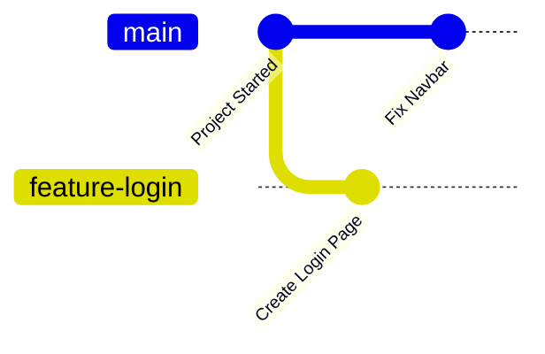

# What is a Branch?

A **branch** in Git is a separate line of development that allows you to work on new features, fix bugs, or experiment with changes without affecting the main project.

In simple words:

> A branch is like creating a copy of your project where you can safely make changes.

When you're happy with the changes, you can merge them back into the main project.

---

# 🎯 Learning Objectives

After completing this lesson, you will be able to:

- Understand what a Git branch is
- Explain why branches are used
- Identify the default branch
- Understand how developers use branches in real projects

---

# 🤔 Why Do We Need Branches?

Imagine you're building a **Food Delivery App**.

The application already works, and users are using it every day.

Now you want to add:

- Login System
- Payment Gateway
- Dark Mode

If you directly modify the main project and accidentally introduce a bug, the entire application could stop working.

Branches solve this problem.

They give you a safe workspace to develop without affecting the stable version.

---

# 🌍 Real-World Example

Imagine writing your final semester project report.

Instead of editing the original report directly, you first create a copy.

You make all your changes in the copy.

If everything looks good, you replace the original report with the updated version.

Git branches work exactly like this.

---

# 🖼️ Visual Diagram



The **main** branch continues to stay stable while new work happens in another branch.

---

# What is the Default Branch?

When you create a new Git repository, Git creates a default branch.

Nowadays, the default branch is usually:

```text
main
```

Older repositories may use:

```text
master
```

Most modern projects use **main**.

---

# Why Developers Use Branches

Branches allow developers to:

- Develop new features safely
- Fix bugs independently
- Experiment without risk
- Collaborate with teams
- Keep the main project stable

Without branches, teamwork would become very difficult.

---

# Example Scenario

Suppose you're building an E-commerce website.

You decide to create different branches for different tasks.

```text
main
│
├── feature/login
├── feature/cart
├── feature/payment
├── bugfix/navbar
└── feature/profile
```

Each feature is developed separately.

Once completed, it is merged into the main branch.

---

# 💻 View Available Branches

To see all branches in your repository:

```bash
git branch
```

Example output:

```text
* main
```

The `*` indicates the branch you are currently working on.

---

# Command Breakdown

| Command | Purpose |
|----------|---------|
| `git branch` | Lists all local branches |
| `main` | Default branch |
| `*` | Current active branch |

---

# ⚠️ Common Beginner Mistakes

### ❌ Editing Everything in `main`

Beginners often make all changes directly in the main branch.

Professional developers usually create a new branch before starting new work.

---

### ❌ Confusing Branches with Repositories

A branch is **not** another repository.

A repository can have many branches.

Example:

```text
Repository
    │
    ├── main
    ├── feature/login
    ├── bugfix/navbar
    └── feature/dashboard
```

---

### ❌ Thinking Branches Duplicate Files

Branches don't create a completely separate copy of your project on your computer.

Git efficiently stores only the differences between branches.

---

# 💡 Pro Tip

Create a new branch whenever you:

- Start a new feature
- Fix a bug
- Experiment with an idea
- Work on a team project

This keeps your project clean and organized.

---

# 📝 Quick Quiz

### 1. What is a Git branch?

- A. Another GitHub account
- B. A copy of a repository used for independent development
- C. A programming language
- D. A folder

<details>
<summary>✅ Answer</summary>

**B.** A branch is a separate line of development that allows you to work independently without affecting the main project.

</details>

---

### 2. What is the default branch in most modern Git repositories?

- A. develop
- B. production
- C. main
- D. branch

<details>
<summary>✅ Answer</summary>

**C. main**

</details>

---

# 💻 Practice Exercise

1. Open one of your Git repositories.

2. Run:

```bash
git branch
```

3. Observe the output.

4. Identify your current branch.

---

# 📚 Summary

Today you learned:

- ✅ What a Git branch is
- ✅ Why branches are important
- ✅ The default branch (`main`)
- ✅ How developers use branches
- ✅ How to view existing branches

---

# 🚀 Next Lesson

Continue to:

```text
why-branches-are-important.md
```
