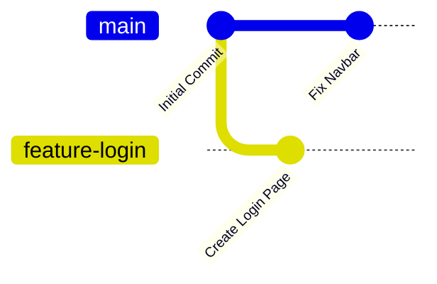

# 📖 Lesson Title

Short introduction (2–3 lines).

Example:

```md
# What is a Branch?

A branch is a separate line of development in Git.

It allows developers to work on new features without affecting the main project.
```

---

# 🎯 Learning Objectives

```md
After completing this lesson, you will be able to:

- Explain what a branch is
- Understand why branches exist
- Create your first branch
- Understand real-world branching
```

---

# 🤔 Why Should You Learn This?

Tell beginners why it matters.

Example:

> Imagine working on a college project with your friends.
>
> One friend is building the login page.
>
> Another is building the dashboard.
>
> If everyone edits the same file at the same time, the project becomes messy.
>
> Git branches solve this problem.

---

# 📚 Explanation

Explain everything in simple English.

Avoid textbook language.

---

# 🖼️ Visual Diagram

Instead of only text, use Mermaid diagrams.

Example:

````md

````

GitHub renders Mermaid diagrams automatically.

---

# 🌍 Real-World Example

Always connect concepts with real life.

Example:

> Branches are like making a copy of a PowerPoint presentation before editing it.
>
> You experiment on the copy.
>
> When you're happy, you replace the original.

---

# 💻 Command

Show the command.

````md
```bash
git branch feature-login
```
````

---

# 📌 Command Breakdown

Instead of just showing:

```bash
git branch feature-login
```

Explain:

| Part          | Meaning              |
| ------------- | -------------------- |
| git           | Git command          |
| branch        | Create/List branches |
| feature-login | Branch name          |

---

# 🖥️ Example

````md
```bash
git branch feature-login

git checkout feature-login
```
````

Explain what happens after each command.

---

# ⚠️ Common Mistakes

Example:

❌ Creating branches with spaces.

❌ Working on the wrong branch.

❌ Forgetting to switch branches.

---

# 💡 Pro Tip

Example:

> Use meaningful branch names like:
>
> * feature/login
> * bugfix/navbar
> * hotfix/payment

instead of:

```
newbranch
branch1
test
```

---

# 📝 Quick Quiz

Example:

### Q1

Which command creates a new branch?

* A. git add
* B. git branch
* C. git push
* D. git clone

<details>
<summary>Answer</summary>

✅ B. `git branch`

</details>

GitHub supports `<details>` tags, so users can reveal the answer themselves.

---

# 💻 Practice

Give a small task.

Example:

```
Task:

1. Create a repository.

2. Create a branch named:

feature-login

3. Switch to that branch.

4. Check the current branch.

```

---

# 📚 Summary

Example:

```
Today you learned:

✅ What a branch is

✅ Why branches exist

✅ How to create a branch

✅ Real-world usage
```

---

# ➡️ Next Lesson

```
Next:

why-branches-are-important.md
```

