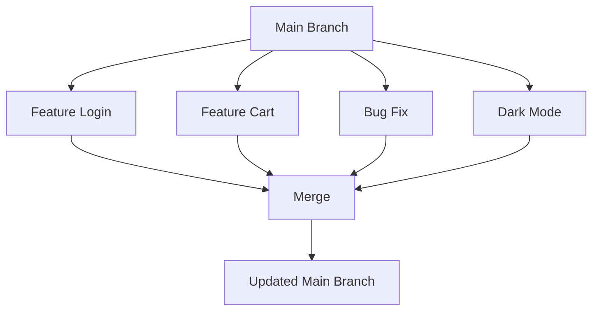

# Why Branches are Important

Now that you know what a branch is, let's understand **why Git branches are one of the most important features in software development.**

Branches help developers work safely, collaborate efficiently, and build better software.

Without branches, working on real-world projects would be difficult and risky.

---

# 🎯 Learning Objectives

After completing this lesson, you will be able to:

- Understand why branches exist
- Explain how branches improve teamwork
- Understand why companies use branches
- Know the benefits of branching in software development

---

# 🤔 Imagine This Scenario

You are building an **E-Commerce Website**.

The website is already live and customers are using it.

Today, your team has these tasks:

- Developer A → Build Login System
- Developer B → Build Shopping Cart
- Developer C → Fix Payment Bug
- Developer D → Improve Homepage UI

If everyone edits the **main** branch at the same time:

❌ Bugs can break the website.

❌ Code may overwrite each other.

❌ It becomes difficult to know who changed what.

This is why branches exist.

---

# 🌍 Real-World Example

Imagine a group of students working on a college presentation.

Instead of everyone editing the same PowerPoint file simultaneously, each student creates a copy, works on their assigned slides, and later combines everything into the final presentation.

Branches work in exactly the same way.

Each developer gets their own workspace.

---

# 🖼️ Visual Representation



Every feature is developed separately and merged only after it is ready.

---

# Benefits of Branching

## 1️⃣ Safe Development

Branches allow developers to experiment without breaking the main project.

Example:

```
Main Project
        │
        ├── Stable
        │
Feature Branch
        │
        ├── New Changes
```

If something goes wrong, only the feature branch is affected.

---

## 2️⃣ Better Team Collaboration

Different developers can work simultaneously.

Example:

| Developer | Branch |
|-----------|--------|
| Alice | feature-login |
| Bob | feature-payment |
| Charlie | bugfix-navbar |
| David | feature-dashboard |

Everyone works independently.

---

## 3️⃣ Easy Bug Fixes

Suppose users report a payment issue.

Instead of changing the main project directly:

Create:

```
bugfix/payment
```

Fix the issue.

Test it.

Merge it.

Simple and safe.

---

## 4️⃣ Easier Code Reviews

Before merging changes into the main branch, other developers can review the code.

This helps:

- detect bugs
- improve quality
- maintain coding standards

---

## 5️⃣ Cleaner Project History

Each branch focuses on one task.

Example:

```
feature-login

feature-dashboard

feature-profile

bugfix-cart
```

This makes project history easier to understand.

---

## 6️⃣ Easy Experimentation

Want to test a new idea?

Create a branch.

Experiment freely.

If the idea doesn't work:

Simply delete the branch.

Your main project remains untouched.

---

# Why Companies Use Branches

Almost every software company uses branching.

Companies use branches for:

- Feature development
- Bug fixing
- Hotfixes
- Release management
- Code reviews
- Team collaboration

Branching is considered a standard industry practice.

---

# Common Branch Types

| Branch | Purpose |
|----------|----------|
| main | Stable production code |
| develop | Ongoing development |
| feature/* | New features |
| bugfix/* | Fix bugs |
| hotfix/* | Urgent production fixes |
| release/* | Prepare new releases |

You don't need to memorize these now.

You'll learn them gradually.

---

# ⚠️ What Happens Without Branches?

Imagine everyone working directly on:

```
main
```

Problems:

❌ Bugs reach production.

❌ Developers overwrite each other's work.

❌ Difficult to test features.

❌ Hard to rollback mistakes.

❌ Team collaboration becomes messy.

Branches solve all of these problems.

---

# 💡 Pro Tip

One branch should focus on **one task only**.

Good examples:

```
feature-login

feature-profile

bugfix-navbar
```

Avoid doing multiple unrelated tasks in one branch.

---

# 📝 Quick Quiz

### 1. Why do developers create branches?

- A. To create another repository
- B. To safely work on changes without affecting the main project
- C. To delete projects
- D. To create GitHub accounts

<details>
<summary>✅ Answer</summary>

**B**

Branches provide an isolated workspace for development.

</details>

---

### 2. Which branch is usually considered the stable version?

- A. feature
- B. bugfix
- C. main
- D. release

<details>
<summary>✅ Answer</summary>

**C. main**

</details>

---

# 💻 Practice Exercise

Imagine you're building a social media application.

Create branch names for:

- Login Feature
- Dark Mode
- Chat System
- Notification Bug
- User Profile

Possible answers:

```
feature/login

feature/dark-mode

feature/chat

bugfix/notifications

feature/user-profile
```

---

# 📚 Summary

Today you learned:

- ✅ Why branches exist
- ✅ How branches help teams
- ✅ Why companies use branches
- ✅ Benefits of branching
- ✅ Common branch types

Branches are one of the biggest reasons Git is so powerful for team development.

---

# 🚀 Next Lesson

Continue to:

```text
creating-a-branch.md
```
