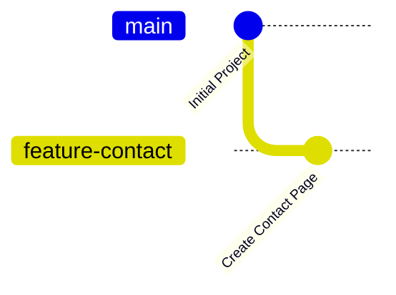

# Creating a Branch

Now that you understand what a branch is and why it is important, it's time to create your first branch.

Creating a branch allows you to work on new features, fix bugs, or experiment with ideas without affecting the main branch.

This is one of the first things developers do before writing code.

---

# 🎯 Learning Objectives

After completing this lesson, you will be able to:

- Create a new Git branch
- Understand branch naming
- View available branches
- Understand where new branches are created

---

# 🤔 Why Create a Branch?

Imagine you're building a **Portfolio Website**.

Today you want to add:

- Contact Page
- Dark Mode
- Animations

Instead of modifying the **main** branch directly, you create a new branch.

This keeps your main project safe while you work.

---

# 🖼️ Visual Representation



The **feature-contact** branch is completely independent from the **main** branch.

---

# Creating Your First Branch

Use the following command:

```bash
git branch feature-login
```

Git creates a new branch called:

```
feature-login
```

At this point:

✅ The branch is created.

❌ You are **still on the main branch**.

This is an important point that many beginners miss.

---

# Command Breakdown

```bash
git branch feature-login
```

| Part | Meaning |
|------|---------|
| git | Git command |
| branch | Create/List branches |
| feature-login | Name of the new branch |

---

# Verify the Branch

Run:

```bash
git branch
```

Example output:

```text
feature-login
* main
```

Notice:

```
*
```

The asterisk indicates your **current branch**.

Although **feature-login** exists, you are still working on **main**.

---

# Real-World Example

Imagine creating a copy of a Word document.

Original:

```
Assignment.docx
```

Copy:

```
Assignment-NewVersion.docx
```

Creating the copy doesn't automatically mean you're editing it.

You must open the new file first.

Git branches work exactly the same way.

---

# Naming Branches

Choose branch names that clearly describe their purpose.

Good examples:

```
feature/login

feature/dashboard

feature/profile

bugfix/navbar

hotfix/payment

release/v1.0
```

Avoid names like:

```
test

branch1

newbranch

abc

temp
```

Meaningful names make collaboration easier.

---

# Where is the New Branch Created?

When you create a branch:

```bash
git branch feature-login
```

Git creates the new branch **from your current branch**.

Example:

```
main
  │
  ├──── feature-login
```

Both branches initially contain the same project.

Later, each branch can have different changes.

---

# Common Beginner Mistakes

### ❌ Forgetting to Switch Branches

Many beginners think:

```
git branch feature-login
```

also switches to the new branch.

It doesn't.

It only creates the branch.

You'll learn switching branches in the next lesson.

---

### ❌ Poor Branch Names

Avoid:

```
test

abc

new

branch2
```

Use meaningful names.

---

### ❌ Creating Too Many Unused Branches

Delete branches that are no longer needed.

Keep your repository clean.

---

# 💡 Pro Tip

Most companies follow naming conventions.

Examples:

```
feature/user-authentication

feature/payment-system

bugfix/login-error

hotfix/security-patch
```

Consistent naming makes repositories easier to manage.

---

# 📝 Quick Quiz

### 1. Which command creates a new branch?

- A. git checkout
- B. git clone
- C. git branch
- D. git commit

<details>
<summary>✅ Answer</summary>

**C. git branch**

</details>

---

### 2. After running:

```bash
git branch feature-login
```

Where are you?

- A. feature-login
- B. main
- C. GitHub
- D. Detached HEAD

<details>
<summary>✅ Answer</summary>

**B. main**

Creating a branch does **not** switch to it.

</details>

---

# 💻 Practice Exercise

1. Open one of your Git repositories.

2. Run:

```bash
git branch feature-profile
```

3. Check available branches:

```bash
git branch
```

4. Observe which branch has the `*`.

---

# 📚 Summary

Today you learned:

- ✅ How to create a branch
- ✅ How to list branches
- ✅ Branch naming conventions
- ✅ Why creating a branch doesn't switch to it

You now know how to create branches like professional developers.

---

# 🚀 Next Lesson

Continue to:

```text
switching-branches.md
```
