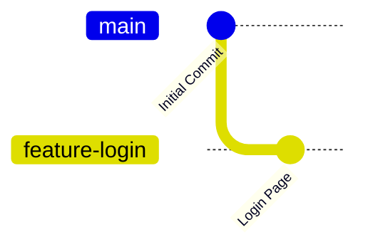

# Switching Branches

In the previous lesson, you learned how to create a branch.

However, creating a branch does **not** automatically switch you to it.

To start working on a branch, you need to switch to it.

---

# 🎯 Learning Objectives

After completing this lesson, you will be able to:

- Switch between branches
- Understand your current branch
- Verify branch changes
- Use modern and older Git commands for switching

---

# 🤔 Why Switch Branches?

Imagine you created a branch called:

```text
feature-login
```

If you continue writing code immediately, where will the changes go?

The answer is:

👉 They will still go to the **main** branch because you're still working there.

That's why switching branches is important.

---

# 🌍 Real-World Example

Imagine you have two notebooks.

Notebook 1:
```
Mathematics
```

Notebook 2:
```
Physics
```

Creating the Physics notebook doesn't mean you're writing in it.

You have to open the Physics notebook first.

Git branches work exactly the same way.

---

# 🖼️ Visual Representation



Notice how Git switches from **main** to **feature-login** before new work begins.

---

# Method 1 — Using `git switch` (Recommended)

Modern versions of Git recommend using:

```bash
git switch feature-login
```

This command switches your current branch to:

```
feature-login
```

---

# Method 2 — Using `git checkout`

Older Git tutorials often use:

```bash
git checkout feature-login
```

This command also switches branches.

Although it still works, Git recommends using `git switch` because it is clearer and easier for beginners.

---

# Command Breakdown

### Using `git switch`

```bash
git switch feature-login
```

| Part | Meaning |
|------|---------|
| git | Git command |
| switch | Change current branch |
| feature-login | Branch to switch to |

---

# Verify Your Current Branch

Run:

```bash
git branch
```

Example output:

```text
* feature-login
  main
```

The `*` symbol shows your current branch.

Now every change you make will go to:

```
feature-login
```

---

# Switching Back to Main

To return to the main branch:

```bash
git switch main
```

or

```bash
git checkout main
```

Now you're back on the stable version of the project.

---

# Create and Switch in One Command

Git also provides a shortcut.

Instead of:

```bash
git branch feature-dashboard

git switch feature-dashboard
```

you can simply run:

```bash
git switch -c feature-dashboard
```

This command:

✅ Creates the branch

✅ Switches to it immediately

---

# Older Alternative

Older Git versions use:

```bash
git checkout -b feature-dashboard
```

It performs the same task.

---

# Real Workflow

```text
Create Branch
       ↓
Switch Branch
       ↓
Write Code
       ↓
Commit Changes
```

This is the normal workflow followed by developers.

---

# Common Beginner Mistakes

## ❌ Forgetting to Switch

Many beginners create a branch:

```bash
git branch feature-login
```

Then immediately start coding.

Unfortunately, they're still on the `main` branch.

Always verify using:

```bash
git branch
```

---

## ❌ Confusing `checkout` and `switch`

Remember:

| Command | Purpose |
|----------|----------|
| `git switch` | Switch branches |
| `git checkout` | Older command for switching and other tasks |

For beginners:

Use:

```bash
git switch
```

---

## ❌ Forgetting Current Branch

Before writing code, always check:

```bash
git branch
```

It only takes one second and prevents many mistakes.

---

# 💼 Industry Insight

Most software teams create a new branch before starting any work.

Typical workflow:

```text
Receive Task
      ↓
Create Branch
      ↓
Switch Branch
      ↓
Write Code
      ↓
Commit
      ↓
Push
      ↓
Pull Request
```

This keeps the `main` branch stable and production-ready.

---

# 💡 Pro Tip

Whenever you start your workday:

Run:

```bash
git branch
```

or

```bash
git status
```

to confirm you're working on the correct branch.

Professional developers do this regularly.

---

# 📝 Quick Quiz

### 1. Which command switches to another branch?

- A. `git add`
- B. `git commit`
- C. `git switch`
- D. `git clone`

<details>
<summary>✅ Answer</summary>

**C. `git switch`**

</details>

---

### 2. Which command creates and switches to a new branch?

- A. `git branch`
- B. `git switch -c`
- C. `git push`
- D. `git init`

<details>
<summary>✅ Answer</summary>

**B. `git switch -c`**

</details>

---

# 💻 Practice Exercise

1. Create a branch:

```bash
git branch feature-profile
```

2. Switch to it:

```bash
git switch feature-profile
```

3. Verify:

```bash
git branch
```

4. Switch back:

```bash
git switch main
```

---

# 📚 Summary

Today you learned:

- ✅ How to switch branches
- ✅ Difference between `git switch` and `git checkout`
- ✅ How to create and switch in one command
- ✅ How to verify your current branch

Switching branches is a fundamental skill that you'll use in almost every Git project.

---

# 🚀 Next Lesson

Continue to:

```text
merging-branches.md
```
