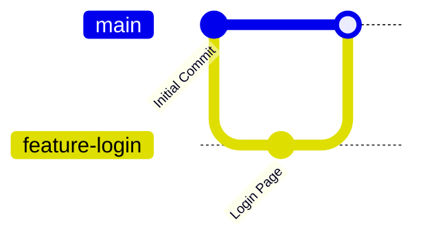
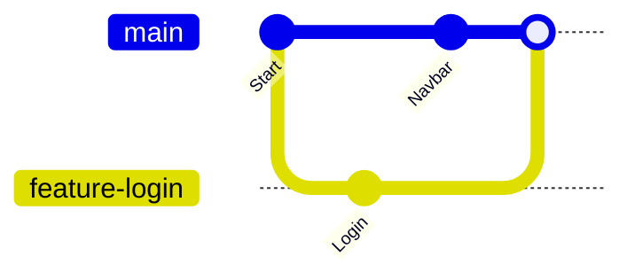

# Merging Branches

Creating branches allows developers to work independently.

But once a feature or bug fix is complete, the changes need to become part of the main project.

This process is called **merging**.

In simple words:

> Merging combines the changes from one branch into another branch.

---

# 🎯 Learning Objectives

After completing this lesson, you will be able to:

- Understand what merging is
- Learn why developers merge branches
- Merge a feature branch into the main branch
- Verify successful merges

---

# 🤔 Why Do We Merge?

Imagine you're building a **Shopping Website**.

You created a branch:

```
feature-login
```

After several hours of work, the login page is complete.

Now you want everyone to use this feature.

Instead of copying files manually, Git allows you to merge the branch into the **main** branch.

---

# 🌍 Real-World Example

Imagine four students working on different chapters of a project.

Student A writes:

```
Introduction
```

Student B writes:

```
Methodology
```

Student C writes:

```
Results
```

Student D writes:

```
Conclusion
```

Once everyone finishes, all chapters are combined into one final report.

Git merging works exactly like this.

---

# 🖼️ Visual Representation



The **feature-login** branch is merged into **main**.

---

# Step 1 — Switch to the Target Branch

Before merging, switch to the branch that should receive the changes.

Usually:

```bash
git switch main
```

You are now on:

```
main
```

---

# Step 2 — Merge the Branch

Run:

```bash
git merge feature-login
```

Git will combine the changes from:

```
feature-login
```

into:

```
main
```

---

# Command Breakdown

```bash
git merge feature-login
```

| Part | Meaning |
|------|---------|
| git | Git command |
| merge | Combine branches |
| feature-login | Branch to merge |

---

# What Happens After Merging?

After merging:

✅ New feature becomes part of the main project.

✅ Commit history is preserved.

✅ Files are updated automatically.

Example:

Before:

```
main

feature-login
```

After:

```
main
│
└── Login Feature Included
```

---

# Verify the Merge

Run:

```bash
git log --oneline
```

You should see commits from both branches.

You can also verify by checking your project files.

---

# Fast-Forward Merge

Sometimes Git performs a **Fast-Forward Merge**.

This happens when:

- nobody modified the main branch
- the feature branch is simply ahead

Example:

```
main
   │
   └──── feature-login
```

Git simply moves the main branch pointer forward.

No extra merge commit is created.

---

# Three-Way Merge

If both branches have new commits, Git performs a **Three-Way Merge**.

Example:



Git combines both histories into one.

---

# Why Developers Merge

Developers merge branches to:

- add completed features
- fix bugs
- integrate team contributions
- prepare releases
- keep the project updated

Merging is a daily activity in software development.

---

# Common Beginner Mistakes

## ❌ Merging into the Wrong Branch

Before merging, always check your current branch.

Run:

```bash
git branch
```

The `*` should be on:

```
main
```

if you want to merge into the main branch.

---

## ❌ Forgetting to Pull Latest Changes

In team projects:

Always update your local repository before merging.

Example:

```bash
git pull
```

---

## ❌ Deleting the Branch Before Merging

Never delete a branch before its work has been merged.

Always merge first.

Delete later.

---

# 💼 Industry Insight

In professional teams:

Developers rarely merge directly into the `main` branch.

Instead:

```
Feature Branch
        ↓
Push
        ↓
Pull Request
        ↓
Code Review
        ↓
Merge
```

This ensures quality and prevents bugs.

---

# 💡 Pro Tip

One branch should represent **one feature**.

Examples:

```
feature-login

feature-dashboard

bugfix-navbar
```

Small branches are easier to review and merge.

---

# 📝 Quick Quiz

### 1. What does merging do?

- A. Deletes a branch
- B. Combines changes from one branch into another
- C. Creates a repository
- D. Uploads code to GitHub

<details>
<summary>✅ Answer</summary>

**B**

Merging combines changes from one branch into another.

</details>

---

### 2. Which command merges a branch?

```text
feature-login
```

into

```text
main
```

- A. `git add`
- B. `git switch`
- C. `git merge feature-login`
- D. `git clone`

<details>
<summary>✅ Answer</summary>

**C**

</details>

---

# 💻 Practice Exercise

1. Create a new branch:

```bash
git switch -c feature-about
```

2. Create a file:

```
about.html
```

3. Commit the changes.

4. Switch back to:

```bash
git switch main
```

5. Merge the branch:

```bash
git merge feature-about
```

6. Verify the file exists in the main branch.

---

# 📚 Summary

Today you learned:

- ✅ What merging is
- ✅ Why developers merge branches
- ✅ How to merge branches
- ✅ Fast-Forward Merge
- ✅ Three-Way Merge
- ✅ Industry workflow

Merging is one of the core concepts that allows multiple developers to work together on the same project.

---

# 🚀 Next Lesson

Continue to:

```text
merge-conflicts.md
```
