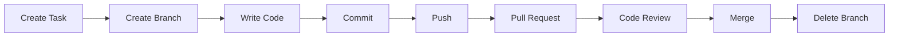

# Branching Best Practices

Learning Git commands is important.

But learning **how professional developers use Git** is even more important.

This lesson covers the best practices followed by software companies, startups, and open-source communities to keep projects organized and maintainable.

---

# 🎯 Learning Objectives

After completing this lesson, you will be able to:

- Follow professional branching practices
- Organize branches effectively
- Avoid common branching mistakes
- Understand industry workflows

---

# Why Best Practices Matter

Imagine working on a project with:

- 5 developers
- 20 branches
- 300 commits
- Thousands of files

Without proper organization, the repository quickly becomes confusing.

Best practices help teams:
- work faster
- reduce mistakes
- improve collaboration
- maintain clean project history

---

# 🏗️ Rule 1 — Never Work Directly on `main`

The `main` branch should always contain stable, working code.

Instead of making changes directly on `main`, create a new branch.

✅ Good

```text
main
   │
   └── feature/login
```

❌ Bad

```text
main
   │
   ├── Random edits
   ├── Unfinished feature
   ├── Broken code
```

---

# 🏷️ Rule 2 — Use Meaningful Branch Names

Choose names that clearly describe the work.

✅ Good

```text
feature/login

feature/payment

feature/dashboard

bugfix/navbar

hotfix/security

release/v1.0
```

❌ Bad

```text
test

new

abc

branch1

mybranch
```

Anyone reading the repository should immediately understand the branch's purpose.

---

# 🎯 Rule 3 — One Branch = One Task

Each branch should focus on **one specific task**.

Example:

```
feature/profile-picture
```

instead of:

```
feature-profile-login-payment-navbar
```

Small branches are easier to:
- review
- test
- merge
- maintain

---

# 🔄 Rule 4 — Pull Before You Start Working

Before creating a new branch or writing code:

```bash
git pull
```

This ensures you are working with the latest version of the project.

It also reduces the chance of merge conflicts.

---

# 💾 Rule 5 — Commit Frequently

Don't wait until you've written hundreds of lines of code.

Instead, create small, meaningful commits.

✅ Good

```text
Add login page

Create validation

Fix login button

Improve UI
```

❌ Bad

```text
Final Update

Everything Done

Changes
```

Small commits make debugging much easier.

---

# 📝 Rule 6 — Write Good Commit Messages

Your commit message should explain **what changed**.

Examples:

```text
Add authentication middleware

Fix responsive navbar

Update README documentation
```

Avoid vague messages like:

```text
update

done

fix

test
```

---

# 🔍 Rule 7 — Review Before Merging

Before merging:

- Test your feature
- Check for errors
- Review your code
- Read your commit messages

Professional developers review their work before every merge.

---

# 🧹 Rule 8 — Delete Completed Branches

After a feature is merged:

```bash
git branch -d feature/login
```

Keeping old branches forever makes repositories cluttered.

Clean repositories are easier to navigate.

---

# 🤝 Rule 9 — Use Pull Requests

Instead of merging directly into `main`:

```
Feature Branch
      ↓
Push
      ↓
Pull Request
      ↓
Review
      ↓
Merge
```

Pull Requests improve:
- collaboration
- code quality
- documentation
- learning

---

# 📂 Rule 10 — Keep Branches Short-Lived

Long-lived branches become difficult to merge.

Instead:

- finish one feature
- merge it
- delete the branch
- start a new one

Short-lived branches reduce merge conflicts.

---

# 🖼️ Professional Workflow



This workflow is followed by many professional teams.

---

# Common Beginner Mistakes

## ❌ Huge Branches

Working on 10 features in one branch makes reviews difficult.

---

## ❌ Never Pulling

Always update your repository before starting work.

---

## ❌ Poor Branch Names

Meaningful names improve teamwork.

---

## ❌ Forgetting to Delete Old Branches

Old branches create unnecessary clutter.

---

## ❌ Skipping Pull Requests

Even for personal projects, practicing Pull Requests builds good habits.

---

# 💼 Industry Insight

Many companies follow branching strategies such as:

- GitHub Flow
- Git Flow
- Trunk-Based Development

Although the details differ, they all emphasize:

- small branches
- code reviews
- frequent merges
- stable production code

As a beginner, mastering the basic workflow is more important than memorizing every branching strategy.

---

# 💡 Pro Tips

✅ One feature per branch

✅ One bug fix per branch

✅ Small commits

✅ Clear commit messages

✅ Frequent pushes

✅ Always review before merging

These habits will make you a better developer.

---

# 📝 Quick Quiz

### 1. Which branch should usually contain stable production-ready code?

- A. feature
- B. bugfix
- C. main
- D. test

<details>
<summary>✅ Answer</summary>

**C. main**

</details>

---

### 2. Which branch name is better?

- A. `branch1`
- B. `test`
- C. `feature/user-profile`
- D. `new`

<details>
<summary>✅ Answer</summary>

**C. feature/user-profile**

</details>

---

# 💻 Practice Exercise

Imagine you're building a learning platform.

Create branch names for:

- Login Page
- Course Dashboard
- Student Profile
- Payment Gateway
- Notification Bug

Possible answers:

```text
feature/login

feature/course-dashboard

feature/student-profile

feature/payment

bugfix/notifications
```

---

# 🏆 Challenge

Create a complete Git workflow:

1. Create a repository
2. Create a feature branch
3. Switch to the branch
4. Add a new file
5. Commit the changes
6. Merge into `main`
7. Delete the branch

Repeat this process for at least **three different features**.

---

# 📚 Summary

Today you learned:

- ✅ Professional branching practices
- ✅ How companies organize branches
- ✅ Better commit habits
- ✅ Branch naming conventions
- ✅ Clean Git workflows

These best practices will help you write cleaner code, collaborate better with teams, and contribute confidently to open-source projects.

---

# 🎉 Section Completed

Congratulations!

You have completed **05 – Branching**.

You now know how to:

- Create branches
- Switch branches
- Merge branches
- Resolve merge conflicts
- Delete branches
- Follow professional branching workflows

These are the same core Git skills used every day by software engineers around the world.

---

# 🚀 Next Section

Continue to:

```text
06-merging-and-rebasing/
```

In the next section, you'll learn advanced history management with topics like:

- Merge vs Rebase
- Cherry-pick
- Revert
- Reset
- Squash commits
- Interactive Rebase

These concepts will take your Git skills from **beginner** to **intermediate**.
