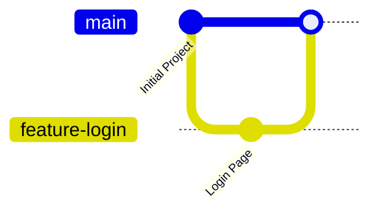

# What is Merging?

In the previous section, you learned how to merge branches.

Now let's understand **what merging actually means** and what Git does behind the scenes.

Merging is one of the most important concepts in Git because it allows multiple developers to work independently and then combine their work into a single project.

---

# 🎯 Learning Objectives

After completing this lesson, you will be able to:

- Explain what Git Merge is
- Understand how Git combines branches
- Know why merging is important
- Understand what happens internally during a merge

---

# 🤔 Why Do We Need Merging?

Imagine you're building an **Online Learning Platform**.

Your team has four developers.

Developer A is building:

```
Login System
```

Developer B is building:

```
Student Dashboard
```

Developer C is working on:

```
Course Search
```

Developer D is fixing:

```
Payment Bug
```

Everyone works independently on different branches.

Eventually, all of these features need to become part of the main project.

This is where Git Merge comes in.

---

# 🌍 Real-World Example

Imagine four authors writing different chapters of a book.

Each author writes separately.

When all chapters are complete, the publisher combines them into one finished book.

Git Merge performs the same job for software projects.

---

# 🖼️ Visual Representation



The changes from `feature-login` become part of the `main` branch.

---

# What Happens During a Merge?

Suppose your repository looks like this:

```text
main

feature-login
```

After merging:

```text
main
│
└── Login Feature Added
```

Git combines the commits from both branches into one project history.

---

# How Git Merge Works

When you run:

```bash
git merge feature-login
```

Git performs several steps automatically:

1. Finds the common ancestor of both branches.
2. Compares the changes made in each branch.
3. Combines the changes if there are no conflicts.
4. Creates a new project history.

If Git cannot combine the changes automatically, it creates a **merge conflict**, which you learned how to resolve in the previous section.

---

# Command Breakdown

```bash
git merge feature-login
```

| Part | Meaning |
|------|---------|
| git | Git command |
| merge | Combine branches |
| feature-login | Branch whose changes should be merged |

---

# Before and After Merge

## Before

```text
main
│
├── Home Page
```

Feature Branch

```text
feature-login
│
├── Login Page
```

---

## After

```text
main
│
├── Home Page
├── Login Page
```

Both features now exist together.

---

# What Does Git Actually Merge?

Git does **not** simply copy files.

Instead, Git merges:

- commits
- file changes
- project history

This makes Git much smarter than simply copying folders.

---

# Benefits of Merging

Git Merge allows developers to:

- combine completed features
- integrate bug fixes
- collaborate with teams
- preserve commit history
- keep development organized

---

# When Do Developers Merge?

Developers typically merge:

- after completing a feature
- after fixing a bug
- after code review
- after a Pull Request is approved

Merging is part of the daily workflow in software development.

---

# Common Beginner Mistakes

## ❌ Thinking Merge Copies Files

Git doesn't just copy files.

It intelligently combines project history and file changes.

---

## ❌ Merging Into the Wrong Branch

Always check your current branch before merging.

Use:

```bash
git branch
```

or

```bash
git status
```

---

## ❌ Forgetting to Test Before Merging

Always test your feature branch before merging it into `main`.

This reduces the chance of introducing bugs.

---

# 💼 Industry Insight

In most companies, developers rarely merge directly into the `main` branch.

Instead, they:

```text
Feature Branch
        ↓
Push
        ↓
Pull Request
        ↓
Code Review
        ↓
Automated Tests
        ↓
Merge
```

This process ensures that only high-quality code reaches the main branch.

---

# 💡 Pro Tip

Merge **small, focused branches**.

Instead of one branch with 20 features:

❌

```text
feature-everything
```

Create:

✅

```text
feature-login

feature-profile

feature-payment
```

Smaller merges are easier to review and less likely to cause conflicts.

---

# 📝 Quick Quiz

### 1. What is Git Merge?

- A. Deletes a branch
- B. Combines changes from one branch into another
- C. Creates a new repository
- D. Uploads code to GitHub

<details>
<summary>✅ Answer</summary>

**B.** Git Merge combines the changes from one branch into another.

</details>

---

### 2. What does Git merge together?

- A. Only folders
- B. Only files
- C. Commits, file changes, and project history
- D. GitHub accounts

<details>
<summary>✅ Answer</summary>

**C.** Git intelligently combines commits, file changes, and project history.

</details>

---

# 💻 Practice Exercise

1. Create a branch:

```bash
git switch -c feature-about
```

2. Create a new file:

```
about.html
```

3. Commit your changes.

4. Switch back to:

```bash
git switch main
```

5. Merge the branch:

```bash
git merge feature-about
```

6. Verify that the new file is available in the `main` branch.

---

# 🏆 Challenge

Create three feature branches:

```
feature-home

feature-gallery

feature-contact
```

Add different files in each branch.

Merge them one by one into `main`.

Observe how Git combines the project history.

---

# 📚 Summary

Today you learned:

- ✅ What Git Merge is
- ✅ Why merging is important
- ✅ How Git combines branches
- ✅ What Git merges internally
- ✅ How professional teams use merging

Understanding merging is essential before learning the different merge strategies in the next lesson.

---

# 🚀 Next Lesson

Continue to:

```text
02-fast-forward-vs-three-way-merge.md
```
