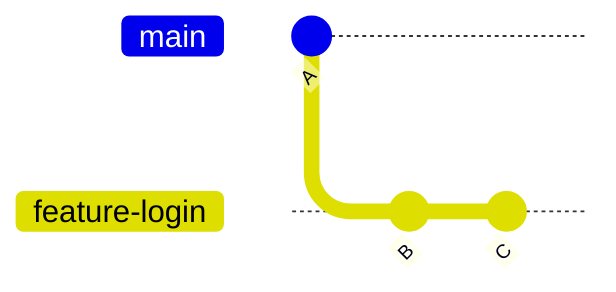
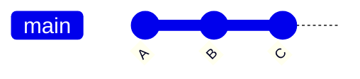
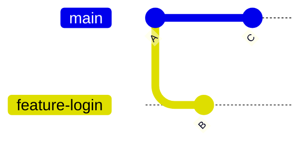
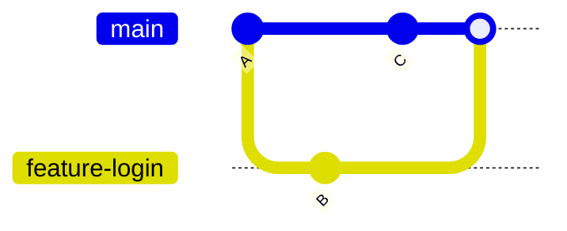

# Fast-Forward Merge vs Three-Way Merge

When you run:

```bash
git merge
```

Git doesn't always merge branches the same way.

Depending on the commit history, Git chooses one of two merge strategies:

- Fast-Forward Merge
- Three-Way Merge

Understanding these strategies helps you better understand Git history and collaborate more effectively.

---

# 🎯 Learning Objectives

After completing this lesson, you will be able to:

- Understand Fast-Forward Merge
- Understand Three-Way Merge
- Know when Git chooses each strategy
- Read Git commit history more confidently

---

# 🤔 Why Are There Different Merge Types?

Imagine you're writing a book.

Scenario 1:

Only one author wrote a new chapter.

Adding it to the book is simple.

Scenario 2:

Two authors edited different chapters at the same time.

Now the publisher must combine both sets of changes.

Git works in a similar way.

Sometimes merging is simple.

Sometimes Git must combine different development histories.

---

# 🟢 Fast-Forward Merge

A Fast-Forward Merge happens when:

- the target branch has **not changed**
- only the feature branch contains new commits

Git simply moves the branch pointer forward.

No new merge commit is created.

---

# 🖼️ Fast-Forward Merge

Before merge:



Merge:

```bash
git merge feature-login
```

After merge:



Git simply moves `main` to the latest commit.

This is called a **Fast-Forward Merge**.

---

# Why is it Called Fast-Forward?

Imagine watching a movie.

Instead of editing the movie, you simply move the playback position forward.

Git does the same thing.

It advances the branch pointer.

Nothing needs to be combined.

---

# Characteristics of Fast-Forward Merge

✅ No merge commit

✅ Clean history

✅ Faster

✅ Linear commit history

---

# 🔵 Three-Way Merge

A Three-Way Merge happens when:

- both branches contain new commits

Git must combine two different histories.

Because both branches changed independently, Git creates a new **merge commit**.

---

# 🖼️ Three-Way Merge

Before merge:



Merge:

```bash
git merge feature-login
```

After merge:



Git creates a brand-new merge commit.

---

# Why is it Called Three-Way Merge?

Git compares three commits:

1. Common ancestor
2. Current branch
3. Branch being merged

Using these three points, Git decides how to combine the changes.

---

# Fast-Forward vs Three-Way Merge

| Fast-Forward | Three-Way |
|--------------|-----------|
| No merge commit | Creates merge commit |
| Linear history | Branch history preserved |
| Simpler | More detailed history |
| Used when only one branch changed | Used when both branches changed |

---

# Which One is Better?

Neither is always better.

It depends on the project.

### Fast-Forward

Best for:

- personal projects
- simple repositories
- clean linear history

---

### Three-Way

Best for:

- team projects
- open source
- preserving branch history
- understanding feature development

---

# How Git Chooses

Git automatically decides.

If `main` hasn't changed:

✅ Fast-Forward

If both branches changed:

✅ Three-Way Merge

You usually don't need to tell Git which one to use.

---

# Example Timeline

## Fast-Forward

```text
main

A

↓

feature

A → B → C

↓

Merge

↓

main

A → B → C
```

---

## Three-Way

```text
A

├── B

└── C

↓

Merge

↓

A

├── B

└── C

↓

M
```

`M` is the merge commit.

---

# Common Beginner Mistakes

## ❌ Thinking Every Merge Creates a Merge Commit

It doesn't.

Fast-Forward merges create **no** merge commit.

---

## ❌ Thinking Three-Way Merge Means Conflict

A Three-Way Merge is completely normal.

A merge conflict only happens if Git cannot automatically combine the changes.

---

## ❌ Trying to Memorize Instead of Understanding

Remember this simple rule:

```
One branch changed

↓

Fast-Forward

Both branches changed

↓

Three-Way
```

---

# 💼 Industry Insight

Many companies intentionally disable Fast-Forward merges.

Why?

Because merge commits clearly show:

- when features were merged
- who merged them
- which Pull Request introduced them

This makes project history easier to understand.

GitHub even allows repository administrators to configure merge strategies.

---

# 💡 Pro Tip

Don't worry about forcing a specific merge strategy while you're learning.

Focus first on understanding:

- how Git chooses a strategy
- what the commit history looks like afterward
- when merge commits appear

---

# 📝 Quick Quiz

### 1. Which merge creates a merge commit?

- A. Fast-Forward Merge
- B. Three-Way Merge
- C. Both
- D. Neither

<details>
<summary>✅ Answer</summary>

**B. Three-Way Merge**

</details>

---

### 2. When does Git perform a Fast-Forward Merge?

- A. When both branches changed
- B. When only the feature branch has new commits
- C. Every merge
- D. Never

<details>
<summary>✅ Answer</summary>

**B**

</details>

---

# 💻 Practice Exercise

Create:

```text
feature-login
```

Make two commits.

Do **not** modify the `main` branch.

Merge it.

Observe the commit history.

Now repeat:

This time modify both:

- `main`
- `feature-login`

Merge again.

Observe the difference.

---

# 🏆 Challenge

Create:

```
feature-home

feature-profile
```

Experiment with:

- Fast-Forward Merge
- Three-Way Merge

Run:

```bash
git log --graph --oneline --all
```

Study how the commit graph changes after each merge.

---

# 📚 Summary

Today you learned:

- ✅ What a Fast-Forward Merge is
- ✅ What a Three-Way Merge is
- ✅ How Git chooses a merge strategy
- ✅ Why merge commits are sometimes created
- ✅ How commit history changes after merging

Understanding these two merge strategies will make it much easier to learn **Git Rebase**, which you'll explore in the next lesson.

---

# 🚀 Next Lesson

Continue to:

```text
03-what-is-rebase.md
```
