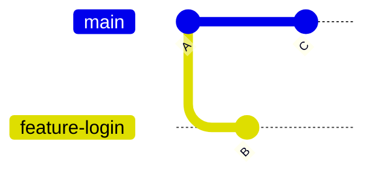
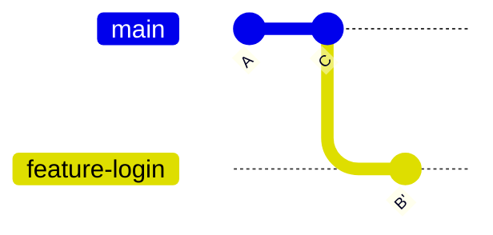

# What is Rebase?

Git provides two common ways to combine work from different branches:

- **Merge**
- **Rebase**

In the previous lessons, you learned about merging.

Now it's time to learn **Git Rebase**.

At first, rebase may seem confusing, but once you understand the idea behind it, it becomes one of the most powerful Git features.

---

# 🎯 Learning Objectives

After completing this lesson, you will be able to:

- Understand what Git Rebase is
- Learn how Rebase differs from Merge
- Understand why developers use Rebase
- Visualize how Git rewrites commit history

---

# 🤔 Why Do We Need Rebase?

Imagine you started working on a feature branch.

While you were working, other developers continued making commits on the `main` branch.

Now your branch is behind the latest version of the project.

You have two choices:

- Merge the latest changes
- Rebase your branch

Both work.

But they create different commit histories.

---

# 🌍 Real-World Example

Imagine you're writing Chapter 5 of a book.

Meanwhile, the editor updates Chapters 1–4.

Instead of inserting your chapter into the old version of the book, you move your work onto the latest version.

That's exactly what **Git Rebase** does.

It moves your work onto the newest base.

---

# 🖼️ Before Rebase



Current situation:

```
main

A → C

feature-login

A → B
```

Both branches have moved independently.

---

# What Does Rebase Do?

When you run:

```bash
git rebase main
```

Git temporarily removes the commits from your current branch.

Then it moves your branch to the latest commit on `main`.

Finally, it replays your commits one by one.

---

# 🖼️ After Rebase



Notice something important:

```
B'
```

This is **not** the original commit.

Git creates a **new commit** that contains the same changes.

This is why we say:

> **Rebase rewrites commit history.**

---

# How Rebase Works

Suppose your history looks like this:

```
main

A → C

feature-login

A → B
```

Run:

```bash
git rebase main
```

Git performs these steps:

1. Finds commits unique to your branch.
2. Temporarily removes them.
3. Updates your branch to the latest `main`.
4. Reapplies your commits one at a time.

Result:

```
main

A → C

↓

feature-login

A → C → B'
```

Your feature now appears to have started from the latest version of `main`.

---

# Command Breakdown

```bash
git rebase main
```

| Part | Meaning |
|------|---------|
| `git` | Git command |
| `rebase` | Move commits to a new base |
| `main` | Base branch |

---

# Why Developers Use Rebase

Rebase helps:

- create cleaner commit history
- reduce unnecessary merge commits
- make project history easier to read
- simplify Pull Requests

Many teams prefer a linear Git history.

---

# Merge vs Rebase (Quick Preview)

### Merge

```
A

├── B

└── C

↓

Merge Commit
```

History keeps both branches.

---

### Rebase

```
A

↓

C

↓

B'
```

History becomes linear.

You'll compare these in detail in the next lesson.

---

# Does Rebase Change Code?

No.

The **code stays the same**.

What changes is the **commit history**.

Git creates new commits that represent the same work on a different base.

---

# Common Beginner Mistakes

## ❌ Thinking Rebase Changes Files

Rebase changes **history**, not the final code.

---

## ❌ Thinking Rebase Deletes Commits

Your work isn't lost.

Git replays your commits on top of a new base.

---

## ❌ Rebasing Shared Branches

Avoid rebasing branches that other people are already using.

Because rebase rewrites history, it can cause problems for collaborators.

A common rule is:

> **Rebase your own local branches. Avoid rebasing shared branches unless your team has agreed on that workflow.**

---

# 💼 Industry Insight

Many software teams use this workflow:

```
git pull

↓

git rebase main

↓

Resolve Conflicts (if any)

↓

Continue Working

↓

Push Changes
```

Some companies prefer merge-based workflows.

Others prefer rebase-based workflows.

The choice depends on team conventions.

---

# 💡 Pro Tip

Remember this sentence:

> **Merge preserves history. Rebase rewrites history.**

If you understand this one idea, you're already halfway to mastering rebase.

---

# 📝 Quick Quiz

### 1. What does Git Rebase do?

- A. Deletes commits
- B. Moves your commits onto a new base
- C. Creates a repository
- D. Deletes branches

<details>
<summary>✅ Answer</summary>

**B**

Git moves your commits onto a newer base and replays them.

</details>

---

### 2. What does Rebase rewrite?

- A. Files
- B. Images
- C. Commit history
- D. Repository name

<details>
<summary>✅ Answer</summary>

**C. Commit history**

</details>

---

# 💻 Practice Exercise

Create a repository.

Create a branch:

```bash
git switch -c feature-profile
```

Make one commit.

Switch back to `main`.

Create another commit.

Switch back:

```bash
git switch feature-profile
```

Run:

```bash
git rebase main
```

Observe how the commit history changes.

---

# 🏆 Challenge

Use:

```bash
git log --graph --oneline --all
```

Run it:

- before rebase
- after rebase

Compare the graphs.

Notice how the commit history becomes more linear.

---

# 📚 Summary

Today you learned:

- ✅ What Git Rebase is
- ✅ Why developers use Rebase
- ✅ How Rebase works internally
- ✅ Why Rebase rewrites commit history
- ✅ Why Rebase creates a linear history

Rebase is one of Git's most powerful features and is widely used in professional software development.

---

# 🚀 Next Lesson

Continue to:

```text
04-merge-vs-rebase.md
```
