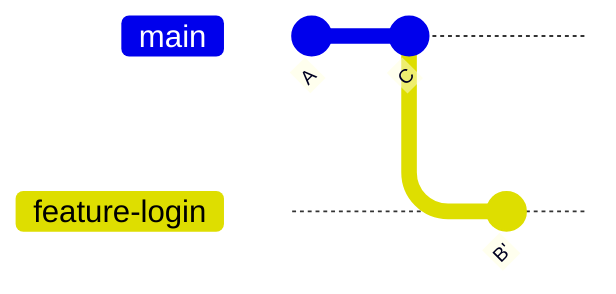

# Merge vs Rebase

Now that you've learned both **Merge** and **Rebase**, it's time to compare them.

This is one of the most frequently asked Git interview questions.

Both commands combine work from different branches, but they do it in very different ways.

Understanding **when to use Merge** and **when to use Rebase** is an essential Git skill.

---

# 🎯 Learning Objectives

After completing this lesson, you will be able to:

- Understand the difference between Merge and Rebase
- Know when to use each approach
- Compare commit history
- Choose the right workflow for different situations

---

# 🤔 Why Do We Have Two Commands?

Imagine two developers working on different features.

At some point, both features need to become part of the same project.

Git provides two approaches:

## Option 1

Keep the complete history exactly as it happened.

↓

Use **Merge**

---

## Option 2

Rewrite history to make it look cleaner.

↓

Use **Rebase**

Both approaches are valid.

The best choice depends on your team's workflow.

---

# 🌍 Real-World Example

Imagine two roads joining together.

### Merge

The roads keep their original paths.

You can always see where each road came from.

### Rebase

One road is rebuilt so it looks like it was always part of the main road.

The destination is the same.

The history is different.

---

# 🖼️ Merge Example


Result:

```
A

├── B

└── C

↓

Merge Commit
```

Notice:

The branch history is preserved.

---

# 🖼️ Rebase Example



Result:

```
A

↓

C

↓

B'
```

History becomes linear.

---

# Key Difference

## Merge

Git combines branch histories.

Creates a merge commit (in most cases).

Original commit history is preserved.

---

## Rebase

Git moves your commits onto another branch.

Creates new commits.

History becomes cleaner and linear.

---

# Visual Comparison

## Merge

```text
A

├── B

└── C

↓

M
```

`M` = Merge Commit

---

## Rebase

```text
A

↓

C

↓

B'
```

No merge commit.

---

# Comparison Table

| Feature | Merge | Rebase |
|----------|--------|---------|
| Preserves history | ✅ Yes | ❌ No |
| Rewrites history | ❌ No | ✅ Yes |
| Creates merge commit | Usually | No |
| Linear history | ❌ No | ✅ Yes |
| Easier for beginners | ✅ Yes | ⚠️ Slightly harder |
| Common in open source | ✅ Yes | ✅ Yes |
| Safe for shared branches | ✅ Yes | ⚠️ Be careful |

---

# Advantages of Merge

✅ Preserves complete project history

✅ Safer for team collaboration

✅ Easier to understand

✅ No history rewriting

---

# Disadvantages of Merge

❌ More merge commits

❌ History can become complex

❌ Commit graph becomes larger

---

# Advantages of Rebase

✅ Clean history

✅ Linear commit graph

✅ Easier to read

✅ Cleaner Pull Requests

---

# Disadvantages of Rebase

❌ Rewrites commit history

❌ Can confuse beginners

❌ Dangerous on shared branches if used incorrectly

---

# When Should You Use Merge?

Merge is a good choice when:

- working with shared branches
- preserving project history is important
- collaborating with large teams
- following a merge-based workflow

---

# When Should You Use Rebase?

Rebase is a good choice when:

- cleaning up your own local branch
- preparing a Pull Request
- creating a linear commit history
- updating your feature branch with the latest `main`

---

# Which One Do Companies Use?

Different companies choose different workflows.

Some teams prefer:

```
Merge Only
```

Others prefer:

```
Rebase Before Merge
```

Some use:

```
Squash and Merge
```

The workflow depends on team preferences and project requirements.

---

# Common Beginner Mistakes

## ❌ Thinking One is Better

Neither Merge nor Rebase is universally better.

They solve different problems.

---

## ❌ Rebasing Shared Branches

Avoid rebasing branches that other developers are already using unless your team has agreed on that workflow.

---

## ❌ Being Afraid of Rebase

Rebase is not dangerous when used correctly.

Practice on your own repositories until you're comfortable.

---

# 💼 Industry Insight

Many companies follow a workflow like this:

```
Create Feature Branch

↓

Work Locally

↓

Rebase onto latest main

↓

Push Branch

↓

Create Pull Request

↓

Merge into main
```

This keeps Pull Requests up to date while maintaining a clean history.

---

# 💡 Pro Tips

✔ Use **Merge** when working with shared history.

✔ Use **Rebase** to clean up your own local work.

✔ Always communicate with your team before rewriting history.

✔ Practice both workflows so you're comfortable with either.

---

# ⚡ Remember

```text
Merge

Preserves History

Creates Merge Commit

Good for Shared Branches

----------------------------

Rebase

Rewrites History

Creates Linear History

Good for Local Branches
```

---

# 📝 Quick Quiz

### 1. Which command rewrites commit history?

- A. Merge
- B. Rebase
- C. Clone
- D. Pull

<details>
<summary>✅ Answer</summary>

**B. Rebase**

</details>

---

### 2. Which command usually creates a merge commit?

- A. Rebase
- B. Merge
- C. Clone
- D. Add

<details>
<summary>✅ Answer</summary>

**B. Merge**

</details>

---

### 3. Which command is generally safer for shared branches?

- A. Rebase
- B. Merge
- C. Reset
- D. Cherry-pick

<details>
<summary>✅ Answer</summary>

**B. Merge**

</details>

---

# 💻 Practice Exercise

1. Create two feature branches.

2. Merge the first branch into `main`.

3. Rebase the second branch onto `main`.

4. Run:

```bash
git log --graph --oneline --all
```

5. Compare the commit history after each approach.

---

# 🏆 Challenge

Create this history:

```text
main

↓

feature-login

↓

feature-dashboard
```

Now:

- Merge `feature-login`
- Rebase `feature-dashboard`
- Observe the difference using:

```bash
git log --graph --oneline --all
```

Write down three differences you notice.

---

# 📚 Summary

Today you learned:

- ✅ Difference between Merge and Rebase
- ✅ How each command works
- ✅ Advantages and disadvantages of both
- ✅ When to use Merge
- ✅ When to use Rebase
- ✅ Professional Git workflows

Understanding this comparison is one of the biggest milestones in mastering Git.

---

# 🚀 Next Lesson

Continue to:

```text
05-how-to-rebase.md
```